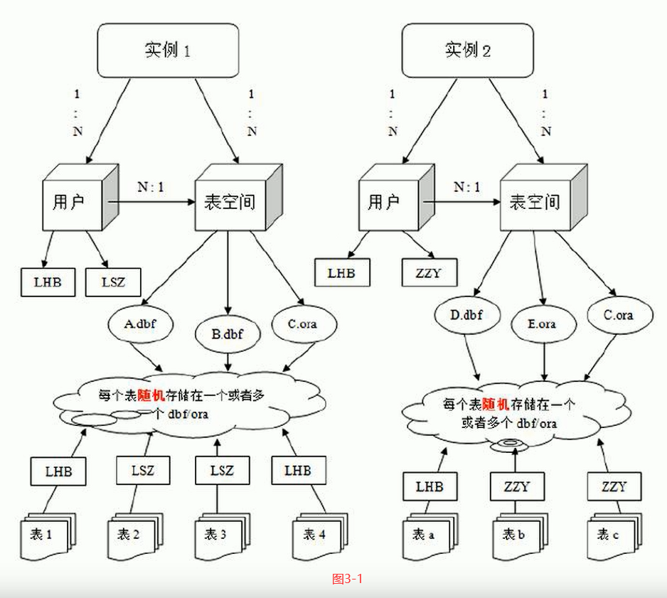

## oracle学习笔记

### 重要概念
> 数据库：侧重于物理存储（硬件），一些数据文件。
> 实例：侧重于线程或者进程，一套硬件上可以运行多个实例，一般运行一个实例。
> 用户：Oracle中管理表的基本单位是用户（某用户下有几张表），MySQL中管理表的基本单位是数据库（当前数据库下有几张表）。
> 表空间：逻辑单位，当数据库很大不便于管理时，把数据库分成很多块，名为表空间 
> 数据文件：存储dbf、ora文件
    


### 创建、删除表空间
前提：超级管理员权限用户才能创建表空间，如system。
```
--创建名为test1的表空间，指定路径，指定大小，指定每次扩容的大小
create tablespace test_tablespace
datafile '数据库服务器目录\test_tablespace.dbf'
size 100m
autoextend on
next 10m;

--删除
drop tablespace test_tablespace;
```

### 创建用户
```
--在表空间test_tablespace中创建用户，名为test_user，密码为password
create user test_user
identified by password
default tablespace test_tablespace

--给用户授权，Oracle数据库有3种常用角色
--connect（连接角色，基本角色）、resource（开发者角色）、dba（超级管理员角色）
--给用户test_user授予dba角色
grant dba to test_user;
```

### 常见数据类型
| 数据类型             | 描述                                             |
|------------------|------------------------------------------------|
| Varchar、Varchar2 | 常用Varchar2，可自动将长度减小为适合存入的数据，都不能扩展              |
| NUMBER           | NUMBER(2)表示长度为n的整数，NUMBER(m,n)表示长度为m的小数，小数部分n位 |
| DATE             | 日期类型                                           |

### 创建表
```
--先名词，后类型
create table test_table(
    pid number(20),
    pname varchar2(10)
);
```
### 参考链接
[视频教程](https://www.bilibili.com/video/BV1aE411K7u8)