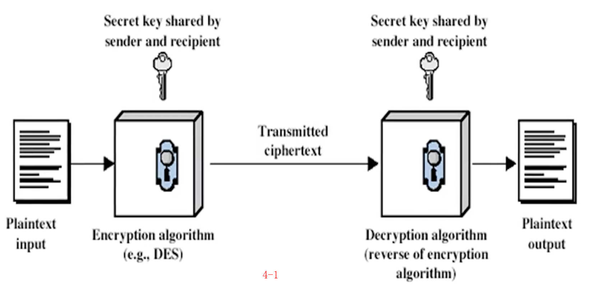

### 对称密钥密码模型
密码的安全需求
- confidentiality 保密性
- integrity 完整性
- availability 可用性

古典密码学要解决的问题：通信保密

三个古典密码系统
- 羊皮传书，两个一样的棍子
- 藏头诗，我爱秋香，又叫隐写术
- 凯撒密码，已知最早的替换密码

相关概念
- P: plaintext 明文
- C: ciphertext 密文
- K: key 密钥
- E: encipher(encrypt) 加密(加密算法)
- D: decipher(decrypt) 解密(解密算法)

这五要素构成一个密码系统，被称为对称密钥密码模型
```
E: P + K >>> C 
D: C + K >>> P 
```




test``'`` union select username,password from users#